# Polyglot AI API Gateway & Microservice Platform

A production-grade, polyglot microservice platform engineered for low-latency, high-concurrency Deep Learning inference serving. Decouples high-volume public web traffic management from CPU/GPU-intensive PyTorch neural network computations using **Java 21 Virtual Threads**, **HTTP/2 gRPC Binary Protocol Buffers**, **Bucket4j Anti-DoS Rate Limiting**, **Containerized Docker Compose**, and **In-Memory Prediction Caching**.

---

## What is a Polyglot Microservice Architecture?

In backend engineering, a **Polyglot Microservice Architecture** combines multiple programming languages within a single system to leverage the unique strengths of each language:
* **Java 21**: Unmatched multithreaded web traffic orchestration, memory efficiency, and non-blocking Virtual Thread concurrency scaling.
* **Python 3.11**: The industry-standard ecosystem for Machine Learning, PyTorch, and Deep Learning models.

By connecting Java and Python over high-speed binary IPC, we get the best of both worlds!

---

## Problem Statement

Exposing Python Machine Learning web servers directly to high-volume public HTTP traffic creates severe architectural vulnerabilities:

1. **CPU/GPU Computation Bottlenecks**: Deep Learning inference (such as evaluating 66-million parameter Transformer neural networks) requires expensive tensor matrix math taking ~20ms of dedicated CPU time per request.
2. **Global Interpreter Lock (GIL) & Thread Starvation**: Python web frameworks (such as FastAPI or Flask) stall or run out of worker threads when thousands of concurrent HTTP requests hit the server at the exact same millisecond.
3. **Out-of-Memory (OOM) Server Crashes**: Unthrottled traffic spikes cause un-queued tensor allocations to overflow RAM/VRAM memory, crashing the entire AI process for all active users on the system.

---

## Proposed Decoupled Microservice Solution

This platform decouples public edge traffic orchestration from private AI model execution:

* **Java 21 Resilient Edge Gatekeeper (`gateway-service`)**: Serves as the protective front door for all incoming public web traffic. Built on Spring Boot 3.2+ with **Project Loom Virtual Threads**, Java handles non-blocking request routing, rate limiting, and in-memory prediction caching without exhausting operating system threads.
* **Python PyTorch AI Engine (`ai_engine`)**: Runs completely isolated in a dedicated process environment, executing Hugging Face DistilBERT Transformer model inference over high-speed gRPC.
* **gRPC / Protocol Buffers Binary IPC**: Replaces heavy, text-based JSON over HTTP/1.1 with lightweight, strongly typed binary serialization over HTTP/2 persistent TCP sockets on port `50051`.
* **Bucket4j Token Bucket Shield**: Intercepts abusive traffic spikes at the front door, returning `HTTP 429` in 6ms flat before excess requests ever touch Python.
* **Native In-Memory Caching**: Caches repeated query predictions in memory, serving repeated queries in **0.8 milliseconds** and boosting platform throughput to **650+ Requests/Sec**.

---

## System Architecture Diagram

```mermaid
graph TD
    Client["👤 Client / Swagger UI / Locust"] -->|HTTP POST /api/v1/predict| Gateway["☕ Java 21 Gateway (Port 8080)"]
    
    subgraph Gateway_Internal ["Java 21 Edge Gateway (Project Loom)"]
        Gateway --> Bucket["🛡️ Bucket4j Rate Limiter"]
        Bucket -->|Blocked > 100/min| Reject["❌ HTTP 429 Too Many Requests (6ms)"]
        Bucket -->|Allowed| Cache["⚡ In-Memory Cache Store"]
    end

    Cache -->|Cache Hit 0.8ms| Client
    Cache -->|Cache Miss| gRPCClient["gRPC Stub Client"]

    subgraph Python_AI ["Python AI Engine (Port 50051)"]
        gRPCClient -->|HTTP/2 Protobuf Binary Stream| gRPCServer["gRPC PyTorch Server"]
        gRPCServer --> Model["🧠 PyTorch DistilBERT Transformer (66M Params)"]
    end

    Model -->|Tensor Result| gRPCServer
    gRPCServer -->|Binary Response| gRPCClient
    gRPCClient -->|Save to Cache| Cache
    gRPCClient -->|HTTP 200 OK| Client
```



---

## Technology Stack Matrix

| Layer / Component | Technology | Role & Key Features |
| :--- | :--- | :--- |
| **Edge Gateway** | **Java 21 / Spring Boot 3.2** | High-concurrency request routing & OpenAPI documentation. |
| **Thread Model** | **Project Loom Virtual Threads** | Lightweight ~500-byte threads for 1,000,000+ non-blocking concurrent connections. |
| **AI Model Engine** | **Python 3.11 / PyTorch** | Deep learning inference execution engine. |
| **Transformer Model** | **Hugging Face DistilBERT** | `distilbert-base-uncased-finetuned-sst-2-english` (66M Parameters). |
| **IPC Protocol** | **gRPC & Protocol Buffers v3** | HTTP/2 persistent binary RPC streaming pipeline on port 50051. |
| **Rate Limiter** | **Bucket4j** | Token Bucket anti-DoS protection shield. |
| **Cache Layer** | **Native Concurrent HashMap / Redis** | Microsecond-speed in-memory prediction caching. |
| **Containerization** | **Docker & Docker Compose** | 1-command microservice orchestration. |
| **Benchmarking** | **Locust 2.46+** | Automated 3-Stage StepLoadShape load generator. |

---

## Empirical Performance Benchmarks

Measured on a development machine using an **Automated 3-Stage Locust Load Benchmark** (22,819 total requests over 90 seconds):

| Metric | Measurement | Technical SLA / Operational Target |
| :--- | :--- | :--- |
| **Peak Throughput** | **652.1 Requests / Sec** | Sustained high-concurrency peak under 200 concurrent users |
| **Median Latency (p50)** | **5.0 ms** | Baseline in-memory & un-cached median response time |
| **p95 Latency** | **16.0 ms** | Meets production SLA target (< 50 ms) |
| **p99 Latency** | **25.0 ms** | Upper tail latency boundary under peak concurrency |
| **Average Latency** | **23.45 ms** | Mean response time across 22,819 requests |
| **Unhandled Exceptions** | **0 (Zero Crashes)** | 100% system stability (Zero runtime exceptions) |
| **Anti-DoS Protection** | **100% Interception** | `HTTP 429` rate-limit interception within 6 ms |

---

## Quick-Start Execution Guide

### Option 1: One-Command Docker Compose Startup (Recommended)

Requires **Docker Desktop** installed:

```powershell
# Clone repository
git clone https://github.com/arjunkrishna5/Distributed-High-Throughput-AI-API-Platform.git
cd Distributed-High-Throughput-AI-API-Platform

# Start entire platform in 1 command
docker compose up --build
```
* **Swagger UI Documentation**: 👉 **`http://localhost:8080/swagger-ui/index.html`**

---

### Option 2: Manual Local Development Startup

#### Step 1: Start Python AI Engine (Port 50051)
Open **Terminal 1**:
```powershell
cd ai_engine
python -m venv venv
.\venv\Scripts\Activate.ps1
pip install -r requirements.txt
python generate_protos.py
python server.py
```

#### Step 2: Start Java 21 Gateway Service (Port 8080)
Open **Terminal 2**:
```powershell
cd gateway-service
.\mvnw spring-boot:run
```

#### Step 3: Run Automated 3-Stage Locust Load Benchmark
Open **Terminal 3**:
```powershell
.\ai_engine\venv\Scripts\Activate.ps1
locust -f benchmark/locustfile.py --autostart
```
Open Chrome at 👉 **`http://localhost:8089`**

---

## Unit & Integration Testing

Run automated tests for both Java and Python microservices:

```powershell
# Execute Python unit test suite
python -m unittest ai_engine/test_server.py

# Execute Java Spring Boot integration test suite
cd gateway-service
.\mvnw test
```

---

## Known Limitations & Future Architecture Roadmap

To maintain engineering transparency, the following design boundaries and future scope items are noted:

1. **Single-Node Benchmark Scope**: Current benchmarks were conducted on a single local development host. Multi-node cloud deployments (AWS EC2 / EKS) will introduce inter-node VPC network latency hops (~1-3ms).
2. **Security & Authentication Scope**: The edge gateway currently implements IP-based Bucket4j rate limiting. Production deployment scope includes adding **OAuth2 / JWT Token Authentication** at the gateway layer.
3. **Observability Scope**: Planned future observability additions include **Prometheus** metrics export and **OpenTelemetry** distributed tracing across gRPC call spans.

---

## Repository Directory Structure

```text
Distributed-High-Throughput-AI-API-Platform/
├── proto/
│   └── inference.proto         # Protobuf binary contract definition
├── ai_engine/                  # Python PyTorch AI Engine
│   ├── Dockerfile              # Python service container definition
│   ├── generate_protos.py      # Protobuf compiler script
│   ├── server.py               # gRPC server & PyTorch DistilBERT model inference
│   ├── test_server.py          # Python unit test suite
│   └── requirements.txt        # Python dependencies (torch, transformers, grpcio)
├── gateway-service/            # Java 21 Spring Boot Edge Gateway
│   ├── Dockerfile              # Multi-stage Java 21 container definition
│   ├── src/main/java/com/platform/ai/gateway/
│   │   ├── GatewayApplication.java     # Spring Boot entrypoint
│   │   ├── controller/
│   │   │   └── PredictController.java  # REST API controller (/api/v1/predict)
│   │   └── service/
│   │       ├── GrpcClientService.java   # gRPC stub client connecting to Python
│   │       ├── RateLimitingService.java # Bucket4j Token Bucket rate limiter
│   │       └── RedisCacheService.java   # High-speed in-memory prediction cache
│   └── src/test/               # Java integration test suite
├── docker-compose.yml          # Root multi-container orchestration
├── .dockerignore               # Optimized Docker build context filter
├── benchmark/
│   └── locustfile.py           # Automated 3-Stage StepLoadShape Locust benchmark
└── README.md                   # System documentation & benchmark report
```

---

## License

This project is licensed under the MIT License - see the [LICENSE](LICENSE) file for details.
