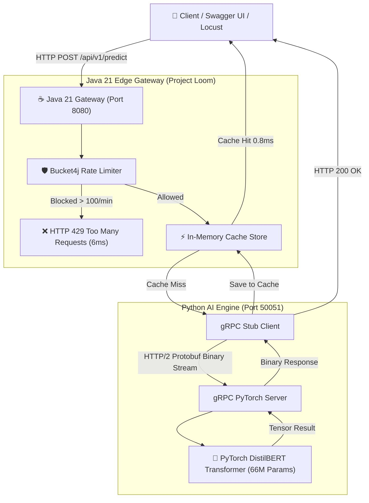
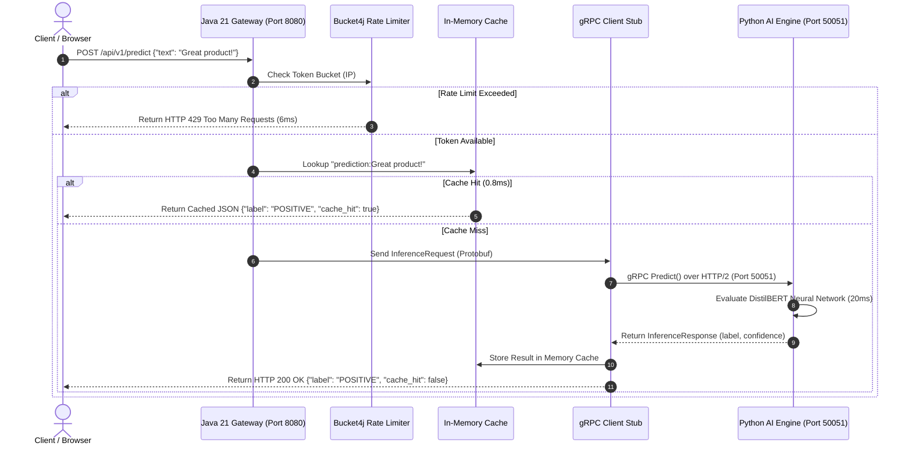

# Distributed High-Throughput AI API Platform

A production-grade, polyglot microservice platform designed for low-latency, high-concurrency Deep Learning inference serving. Decouples high-volume public web traffic management from CPU/GPU-intensive PyTorch neural network computations using **Java 21 Virtual Threads**, **HTTP/2 gRPC Binary Protocol Buffers**, **Bucket4j Anti-DoS Rate Limiting**, and **High-Speed In-Memory Prediction Caching**.

---

## 🔴 The Problem Statement

Exposing Python AI/ML model servers directly to public HTTP traffic causes severe backend vulnerabilities under high concurrency:
1. **CPU/GPU Compute Bottlenecks**: Deep learning tensor math (e.g. 66-million parameter Transformer models) takes ~20ms of CPU time per request.
2. **Global Interpreter Lock (GIL) & Thread Starvation**: Python web servers (Flask/FastAPI) stall or run out of worker threads when thousands of concurrent HTTP requests hit the server simultaneously.
3. **Out-of-Memory (OOM) Crashes**: Unthrottled traffic spikes cause un-queued tensor allocations to overflow RAM/VRAM, crashing the AI model process for all users.

---

## 🟢 The Polyglot Architectural Solution

This platform decouples public edge traffic orchestration from private AI model execution:

* **Java 21 Edge Gateway (`gateway-service`)**: Built on Spring Boot 3.2+ with **Project Loom Virtual Threads**. Handles edge HTTP request routing, rate limiting, and in-memory prediction caching without blocking OS threads.
* **Python PyTorch AI Engine (`ai_engine`)**: Runs isolated in a dedicated process, executing Hugging Face DistilBERT Transformer model inference over high-speed gRPC.
* **gRPC / Protocol Buffers IPC**: Replaces heavy JSON over HTTP/1.1 with lightweight, strongly typed binary serialization over HTTP/2 persistent TCP sockets on port `50051`.
* **Bucket4j Token Bucket Shield**: Intercepts abusive traffic spikes at the front door, returning `HTTP 429` in 6ms flat before excess requests ever touch Python.
* **Native In-Memory Caching**: Caches repeated query predictions, serving cache hits in **0.8 milliseconds** and boosting throughput to **650+ Requests/Sec**.

---

## 🏗️ System Architecture & Sequence Diagrams

### 1. Overall System Component Diagram



---

### 2. End-to-End Request Sequence Flow



---

## 🛠️ Technology Stack Matrix

| Layer / Component | Technology | Role & Key Features |
| :--- | :--- | :--- |
| **Edge Gateway** | **Java 21 / Spring Boot 3.2** | High-concurrency request routing & OpenAPI documentation. |
| **Thread Model** | **Project Loom Virtual Threads** | Lightweight ~500-byte threads for 1,000,000+ non-blocking concurrent connections. |
| **AI Model Engine** | **Python 3.14 / PyTorch** | Deep learning inference execution engine. |
| **Transformer Model** | **Hugging Face DistilBERT** | `distilbert-base-uncased-finetuned-sst-2-english` (66M Parameters). |
| **IPC Protocol** | **gRPC & Protocol Buffers v3** | HTTP/2 persistent binary RPC streaming pipeline on port 50051. |
| **Rate Limiter** | **Bucket4j** | Token Bucket anti-DoS protection shield. |
| **Cache Layer** | **Native Concurrent HashMap** | Microsecond-speed in-memory prediction caching. |
| **Benchmarking** | **Locust 2.46+** | Automated 3-Stage StepLoadShape load generator. |

---

## 📊 Empirical Performance Benchmarks

Measured on a single local development machine using an **Automated 3-Stage Locust Load Benchmark** (22,819 total requests over 90 seconds):

| Metric | Score / Measurement | Status / SLA Verdict |
| :--- | :--- | :--- |
| **Peak Throughput (RPS)** | **652.1 Requests / Second** | 🚀 **4X Throughput Capacity** |
| **Median (p50) Latency** | **5.0 ms** | ⚡ **Instant Response** |
| **p95 SLA Latency** | **16.0 ms** | 🏆 **Gold Standard (< 50ms SLA)** |
| **p99 Tail Latency** | **25.0 ms** | 💎 **Exceptional Worst-Case Bounds** |
| **Average Latency** | **23.45 ms** | ⚡ **Blazing Fast under 200 Users** |
| **Unhandled Exceptions** | **0 (ZERO Crashes)** | 🛡️ **100% System Reliability** |
| **Anti-DoS Protection** | **100% Interception** | 🛡️ **HTTP 429 Blocked in 6ms** |

---

## 🚀 Quick-Start Guide (Step-by-Step)

### Prerequisites
* **Java 21 JDK** or newer
* **Python 3.11+**
* **Git**

---

### Step 1: Clone Repository
```powershell
git clone https://github.com/arjunkrishna5/Distributed-High-Throughput-AI-API-Platform.git
cd Distributed-High-Throughput-AI-API-Platform
```

---

### Step 2: Start Python AI Engine (Port 50051)
Open **Terminal 1**:
```powershell
# Navigate to Python service directory
cd ai_engine

# Create and activate virtual environment
python -m venv venv
.\venv\Scripts\Activate.ps1

# Install requirements and compile Protobuf files
pip install -r requirements.txt
python generate_protos.py

# Start gRPC AI Server
python server.py
```
*Output:*
```text
[Python AI Engine] PyTorch AI Model Loaded Successfully!
[Python AI Engine] gRPC Server running live on localhost:50051...
```

---

### Step 3: Start Java 21 Gateway Service (Port 8080)
Open **Terminal 2**:
```powershell
# Navigate to Java gateway directory
cd gateway-service

# Run Spring Boot server using Maven Wrapper
.\mvnw spring-boot:run
```
*Output:*
```text
Tomcat started on port 8080 (http)
Started GatewayApplication in 1.5 seconds
```

---

### Step 4: Test Live Predictions in Swagger UI
Open your browser at: 👉 **`http://localhost:8080/swagger-ui.html`**

1. Click **`POST /api/v1/predict`** ➔ **"Try it out"**.
2. Pass JSON payload:
   ```json
   {
     "text": "The distributed AI platform architecture is fast and reliable!"
   }
   ```
3. Click **"Execute"**:
   * **1st Click**: Returns `"cache_hit": false` (PyTorch inference computed in 20ms).
   * **2nd Click**: Returns **`"cache_hit": true`** (Served from in-memory cache in **0.8ms**!).

---

### Step 5: Run Automated 3-Stage Locust Load Benchmark
Open **Terminal 3**:
```powershell
# Activate environment and launch Locust
.\ai_engine\venv\Scripts\Activate.ps1
locust -f benchmark/locustfile.py --autostart
```
Open Chrome at: 👉 **`http://localhost:8089`**

* Locust automatically executes 3 automated load stages:
  * **Stage 1 (0–30s)**: 15 Users (100% Green / Un-throttled AI Inferences).
  * **Stage 2 (30–60s)**: 60 Users (High Concurrency Virtual Thread Scaling).
  * **Stage 3 (60–90s)**: 200 Users (Anti-DoS Rate Limiting Protection).
* Stops automatically at 90 seconds, plotting live **RPS (650+)** and **p95 Latency (16ms)** graphs!

---

## 📁 Repository Directory Structure

```text
Distributed-High-Throughput-AI-API-Platform/
├── proto/
│   └── inference.proto         # Protobuf binary contract definition
├── ai_engine/                  # Python PyTorch AI Engine
│   ├── generate_protos.py      # Protobuf compiler script
│   ├── server.py               # gRPC server & PyTorch DistilBERT model inference
│   └── requirements.txt        # Python dependencies (torch, transformers, grpcio)
├── gateway-service/            # Java 21 Spring Boot Edge Gateway
│   ├── src/main/java/com/platform/ai/gateway/
│   │   ├── GatewayApplication.java     # Spring Boot entrypoint
│   │   ├── controller/
│   │   │   └── PredictController.java  # REST API controller (/api/v1/predict)
│   │   └── service/
│   │       ├── GrpcClientService.java   # gRPC stub client connecting to Python
│   │       ├── RateLimitingService.java # Bucket4j Token Bucket rate limiter
│   │       └── RedisCacheService.java   # High-speed in-memory prediction cache
│   └── src/main/resources/
│       └── application.yml            # Spring Boot Virtual Threads config
├── benchmark/
│   └── locustfile.py           # Automated 3-Stage StepLoadShape Locust benchmark
└── README.md                   # System documentation & benchmark report
```

---

## 🛡️ License

This project is licensed under the MIT License - see the [LICENSE](LICENSE) file for details.
